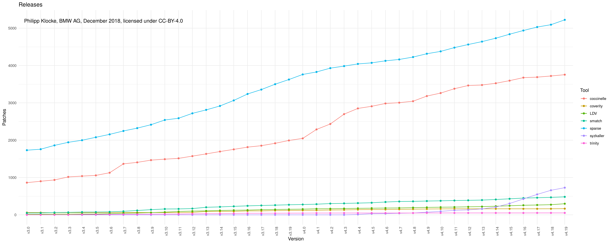
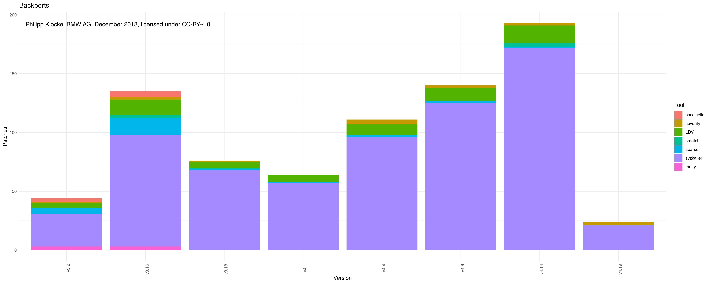

# grep-patch-statistics
Scripts to show patch impact on recent linux kernel development.

# Requirements
- python3
- RScript
	- ggplot2
	- ggrepel
	- grid
	- plyr
- linux-stable git

# Usage
Symlink all files into a linux-stable directory and do everything from there. (Support for path-argument is planned.)

## Generate Data

You can then call `get_patch_data.py` to generate `<prefix>_zero.csv` and `<prefix>_<LTS_Version>.csv`, where you can set `-p --prefix`.
The optional parameter `-f, --filter` allows to specify what to grep for in git logs. If none is given, all commits are considered.

You can further refine your results with `-s --sha_file` by supplying a SHA-File, containing SHAs of commits you're interested in, one on each line.

By setting `-v --version`, you can give one kernel version and get data for all patch levels of this version.

Sometimes it's necessary to start counting commits at 0, because you're not interested in the ground value. E.g. you want to plot 4.9 - 4.9.y, but start at 0. That's what the `-0` flag is for.

## Plot Data

### Line-Chart for time-series
Call `plot_zero_aggregated.R <prefix1>_zero.csv [<prefix2>_zero.csv]...` to generate `aggregated_zero.png`. It contains a line for each filter, to track the amount of commits matching it.

Note that you can also supply files for a fixed version (`-v` flag) and plot patches over the series of patch levels (e.g. v4.9 - v4.9.y).

Example:

### Bar-Chart for backports
You will first need to create an aggregated file containing all backports summed up for each LTS version.
This is done automatically by using the `lts_backports_table.py` script.

Then call `plot_lts_aggregated.R LTS_aggregated.csv` to generate `LTS_aggregated.png`.

Example:

