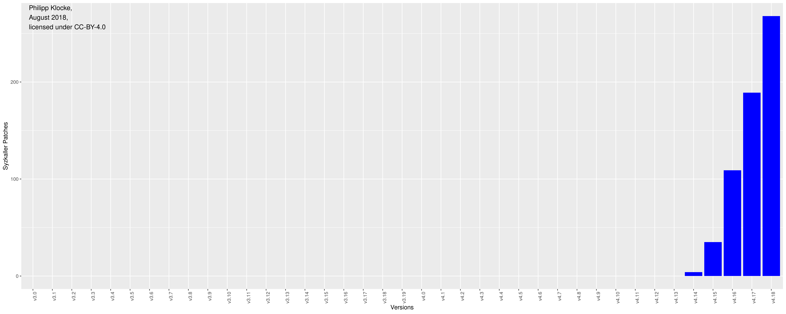
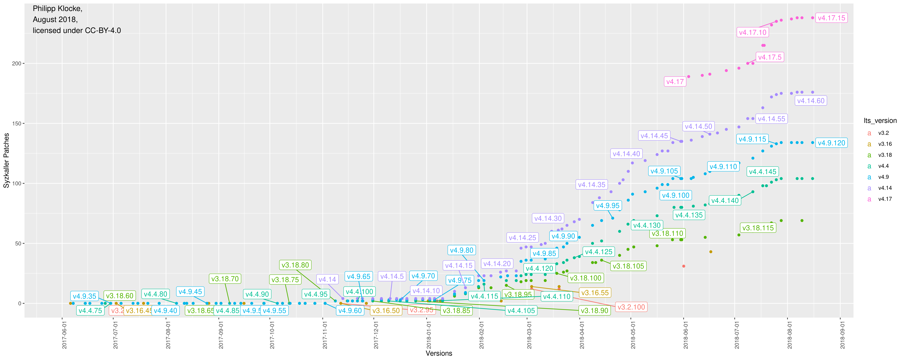

# grep-patch-statistics
Scripts to show patch impact on recent linux kernel development.

# Requirements
- python3
- RScript
	- ggplot2
	- ggrepel
	- grid
	- plyr
- linux-stable git

# Usage
Move `get_patch_data.py` into a linux-stable directory. You can then call this script to generate `<prefix>_zero.csv` and `<prefix>_<LTS_Version>.csv`, where you can set `-p --prefix`. It defaults to `syzkaller`.
The optional parameter `-f, --filter` allows to specify what to grep for in git logs. It defaults to `syzkaller.appspotmail.com`.

## Dot-Zero Versions
Call `plot_zero.R <prefix>_zero.csv` to generate `patches_zero.png`.

For syzkaller this looks like the following:

## LTS Versions
Call `plot_lts.R <prefix>_<LTS_Version_1>.csv [<prefix>_<LTS_Version_2>.csv]...` to generate `patches_LTS.png`. Note that you have to supply the .csv files in correct order.

Example (again for syzkaller):

